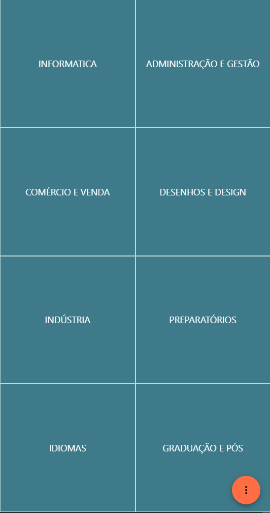
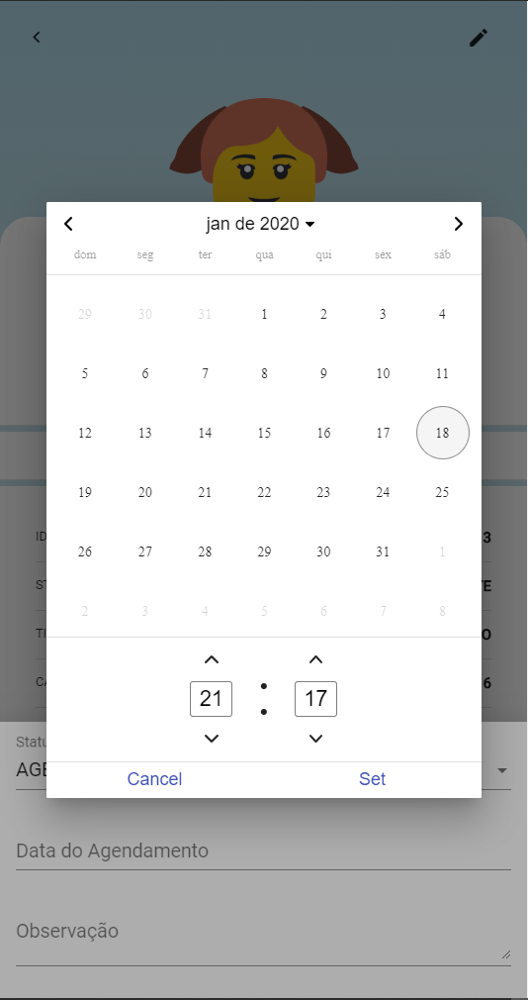

# prep-leads
Trabalho de conclusão de curso desenvolvido para uma escolha de cursos profissionalizantes para gerenciar seus prospects.

# Principais Funções:
<p>Registrar interesse dos propects em cursos.</p>
<p>Agendar e acompanhar visitas.</p>
<p>Registrar a participação de cada colaborador no processo.</p>
<p>Operar em toda plataforma web com segurança.</p>

# Principais Telas
<p>
  
  
  
</p>

<p>
  
  
  
</p>

# Tecnologias
<p>DB: Mysql
<p>API: Spring Boot, Spring Security With Oauth2 e JPA, Flyway Migration.
<p>UI: Angular 8, Json e JWT.

# Pré-requisitos
Mysql, NPM, Angular 8 e Java 11

# Começando os testes
Com o Mysql instalado, o usuário deve ser informado no arquivo src.main.java.resources.application.properties
```
spring.jpa.database=MYSQL
spring.datasource.url=jdbc:mysql://localhost/empresa?createDatabaseIfNotExist=true&useTimezone=true&serverTimezone=UTC
spring.datasource.username=root
spring.datasource.password=123
```
Todo o esquema do bando é montado assim que aplicação é iniciada.

Pode também ser definida a origem e a porta de operação da API.
```
prepweb.security.origin-allowed=http://localhost:4200
server.port: 8080
```

Já no Angular toda configuração fica no arquivo src.environment.ts
```
export const environment = {
  production: true,
  protocolApi: 'http',
  urlApi:  'localhost',
  portApi: '8080',
  passUi: 'Basic YW5ndWxhcjoxMjM=',
  whitelistedDomains: [ 'localhost:8080' ],
  blacklistedRoutes: [ '/oauth/token'],
};
```
Basta definir o domínio e aporta desejada e executar.
```
npm start
```

# Produção
API
Para produção pode-se usar o próprio executável jar ou gerar o WAR e implantar no Tomcat.

UI
No Angular pode-se construir o diretório e implanta-lo em um servidor de páginas como o Apache.
